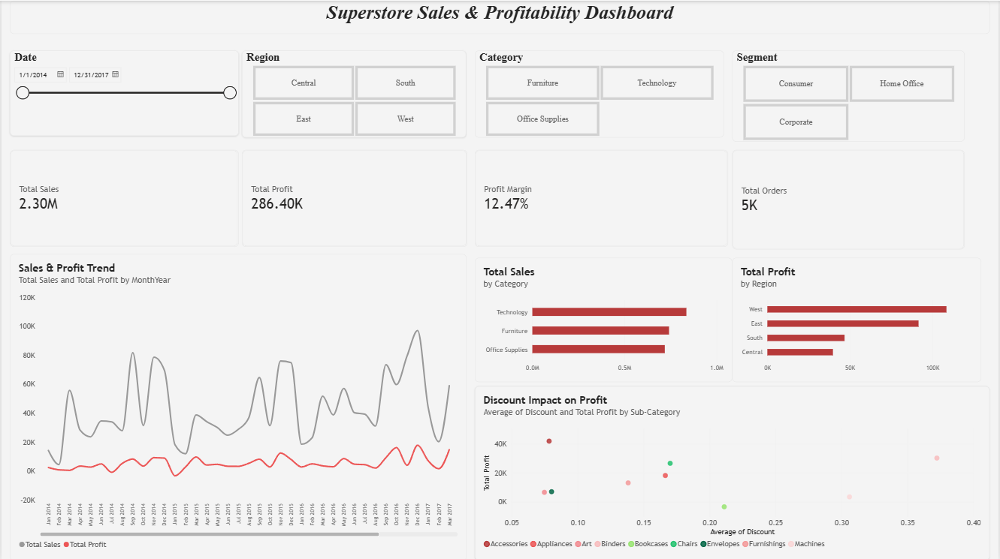

# Superstore Sales & Profitability Dashboard

## 📌 Overview
This project explores sales and profitability patterns in a retail "Superstore" dataset using Power BI. The dashboard turns raw transactional data into an interactive tool that helps answer key business questions: Which products sell the most? Which regions are most profitable? And where is discounting hurting margins instead of helping?

This was built as part of a hands-on data analytics learning roadmap, focused on going beyond basic charts and applying real data storytelling principles reducing visual clutter, using color with intention, and surfacing a clear takeaway rather than just displaying numbers.

## 📊 Dataset
The dataset (`superstore.csv`) contains order-level retail transaction records spanning 2014–2017, including:

- **Order Date / Ship Date** – when each order was placed and shipped
- **Region / State** – the geographic location tied to each order (Central, East, South, West)
- **Category / Sub-Category** – product classification (Technology, Furniture, Office Supplies, and their sub-categories like Chairs, Binders, Machines, etc.)
- **Segment** – type of customer (Consumer, Corporate, Home Office)
- **Sales / Profit / Discount / Quantity** – the financial metrics behind each order

In total, the dataset covers roughly 10,000 rows of order data, giving a realistic picture of a mid-sized retail business.

## 🖼️ Dashboard

### What the dashboard shows
- **KPI Summary Cards** - Total Sales (2.30M), Total Profit (286.40K), Profit Margin (12.47%), and Total Orders (5K), giving an instant health check of the business.
- **Sales & Profit Trend (line chart)** - tracks Total Sales and Total Profit month-by-month, making it easy to spot seasonal spikes and whether profit is keeping pace with sales growth or falling behind.
- **Total Sales by Category (bar chart)** - compares revenue across Technology, Furniture, and Office Supplies, showing Technology as the leading category by sales.
- **Total Profit by Region (bar chart)** - breaks down profitability by Central, East, South, and West, highlighting which regions contribute the most to the bottom line.
- **Discount Impact on Profit (scatter plot)** - plots average discount against total profit across sub-categories, exposing where heavy discounting is eating into margins rather than driving profitable volume.

### Interactivity
The dashboard includes slicers for **Date**, **Region**, **Category**, and **Segment**, letting anyone filter the entire view down to a specific time period, location, product line, or customer type turning it from a static report into an exploratory tool.

## 💡 Key Insight
Technology drives the highest overall sales, but profitability doesn't scale with it evenly some sub-categories with heavy average discounts (visible in the bottom-right scatter plot) show much thinner or even negative profit contribution. This suggests discounting strategy, not just sales volume, is a key lever for improving overall margin.

## 🛠️ Tools Used
- **Power BI Desktop** — data modeling, DAX measures, and interactive dashboard design
- **Dataset**: Superstore Sales dataset (Kaggle)

## 📁 Files in this Repo
- `superstore.csv` raw dataset used for the analysis
- `sales-dashboard.png` screenshot of the final Power BI dashboard
